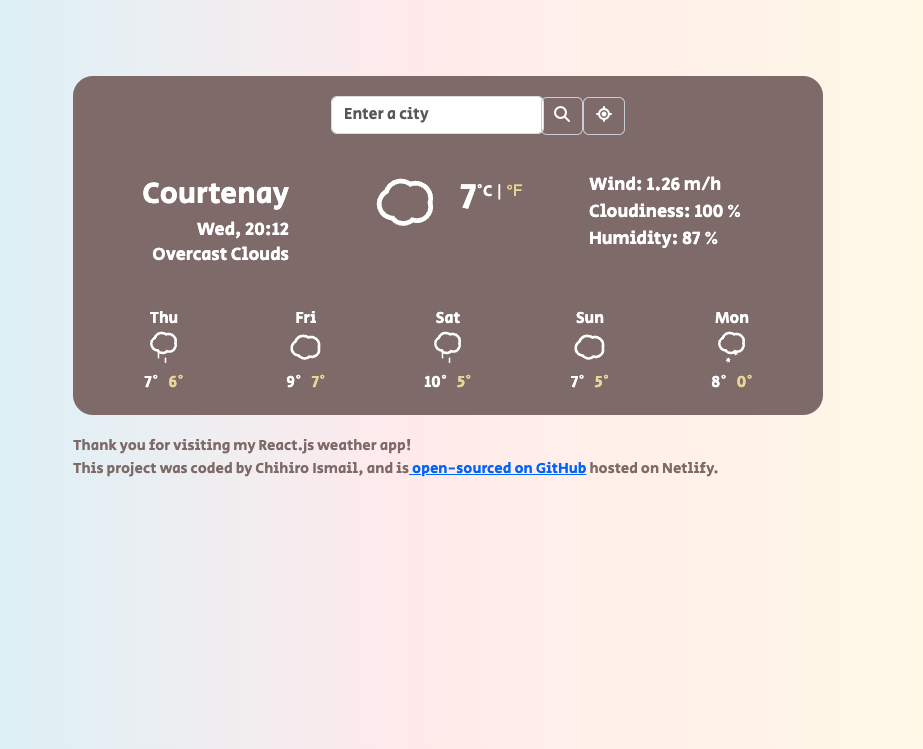

# Weather App on ReactJS

## About

This is a weather web app, where you can check current weather and weather forecast at your current location or locations you specify. You can see my app [here](https://beautiful-brigadeiros-3e9e7f.netlify.app/) hosted on Netlify.

### Features

- displays 5-day weather forcast based on current location and inputed locations including:
  - higest and lowest temperature in celcius / fahrenheit
  - date
  - time
  - wind
  - cloudiness
  - humidity 

# Purpose

The purpose of making this app is mainly for skill development.

- to learn API integration
- to learn user-focused features such as
  - current and searchable locations
  - 5-day outlool
  - essential metrics 
  - unit conversion

# Skills

- ReactJS
- APIs
- Bootstrap
- Git and GitHub
- JavaScript
- CSS
- Hosting

# Wireframe
The below is a wireframe I made before creating the app;

# Scalability

If I decide to enhance my weather app in the future, I would like to add:
  - hourly forcasts
  - theme options: light/dark mode
  - trend visualizations: visualize weather patterns over time for selected locations
